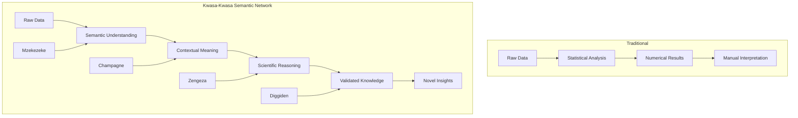
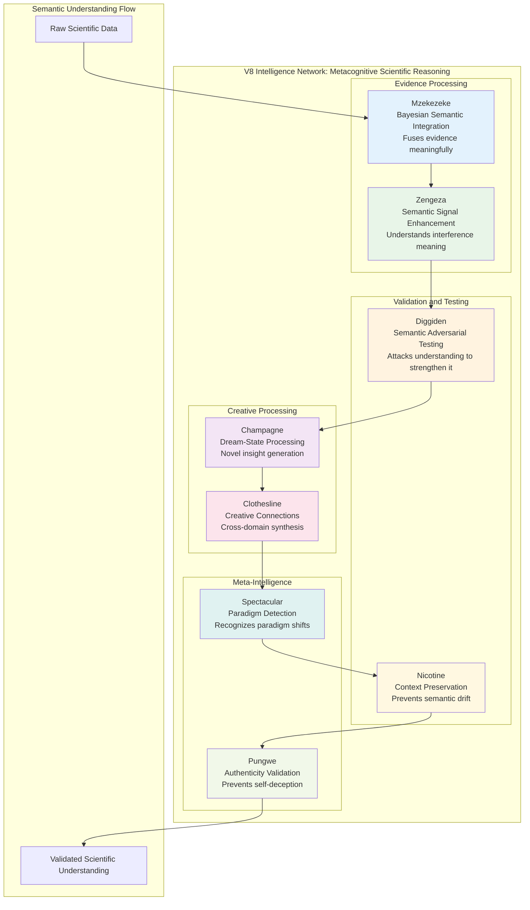

# Semantic Processing Network Overview

## Traditional vs Kwasa-Kwasa Approach

```mermaid
graph TD
    subgraph Traditional
        T1[Raw Data] --> T2[Statistical Analysis]
        T2 --> T3[Numerical Results]
        T3 --> T4[Manual Interpretation]
    end
    
    subgraph "Kwasa-Kwasa Semantic Network"
        K1[Raw Data] --> K2[Semantic Understanding]
        K2 --> K3[Contextual Meaning]
        K3 --> K4[Scientific Reasoning]
        K4 --> K5[Validated Knowledge]
        K5 --> K6[Novel Insights]
        
        V1[Mzekezeke] --> K2
        V2[Champagne] --> K3
        V3[Zengeza] --> K4
        V4[Diggiden] --> K5
    end
```

## Complete V8 Intelligence Network

```mermaid
graph TB
    subgraph "V8 Intelligence Network: Metacognitive Scientific Reasoning"
        subgraph "Evidence Processing"
            MZE[Mzekezeke<br/>Bayesian Semantic Integration<br/>Fuses evidence meaningfully]
            ZEN[Zengeza<br/>Semantic Signal Enhancement<br/>Understands interference meaning]
        end
        
        subgraph "Validation and Testing"
            DIG[Diggiden<br/>Semantic Adversarial Testing<br/>Attacks understanding to strengthen it]
            NIC[Nicotine<br/>Context Preservation<br/>Prevents semantic drift]
        end
        
        subgraph "Creative Processing"
            CHAMP[Champagne<br/>Dream-State Processing<br/>Novel insight generation]
            CLOTH[Clothesline<br/>Creative Connections<br/>Cross-domain synthesis]
        end
        
        subgraph "Meta-Intelligence"
            SPEC[Spectacular<br/>Paradigm Detection<br/>Recognizes paradigm shifts]
            PUN[Pungwe<br/>Authenticity Validation<br/>Prevents self-deception]
        end
    end
    
    subgraph "Semantic Understanding Flow"
        RAW[Raw Scientific Data] --> MZE
        MZE --> ZEN
        ZEN --> DIG
        DIG --> CHAMP
        CHAMP --> CLOTH
        CLOTH --> SPEC
        SPEC --> NIC
        NIC --> PUN
        PUN --> UNDERSTANDING[Validated Scientific Understanding]
    end
    
    style MZE fill:#e3f2fd
    style ZEN fill:#e8f5e8
    style DIG fill:#fff3e0
    style CHAMP fill:#f3e5f5
    style CLOTH fill:#fce4ec
    style SPEC fill:#e0f2f1
    style NIC fill:#fff8e1
    style PUN fill:#f1f8e9
``` 