# Semantic Processing Workflow Phases

## Complete 8-Phase Processing Pipeline


## Semantic Processing Sequence Flow

```mermaid
sequenceDiagram
    participant Scientist as "👨‍🔬 Scientist"
    participant TRB as "🧠 experiment.trb<br/>Semantic Engine"
    participant V8 as "⚡ V8 Intelligence<br/>Network"
    participant External as "🌐 External Systems<br/>Lavoisier, R, APIs"
    participant FS as "👁️ experiment.fs<br/>Consciousness View"
    participant HRE as "📖 experiment.hre<br/>Decision Memory"
    
    Scientist->>TRB: "Understand diabetes through metabolomics"
    TRB->>V8: Initialize semantic processing network
    
    Note over V8: Zengeza: "Data contains semantic interference"
    V8->>FS: Update consciousness: "Semantic clarity 23%→89%"
    V8->>HRE: Log: "Noise patterns reveal instrument semantics"
    
    TRB->>External: Delegate specialized semantic analysis
    External->>TRB: Return molecular pathway semantics
    
    Note over V8: Diggiden: "Test semantic robustness"
    V8->>V8: Attack analysis with semantic spoofing
    V8->>TRB: "Meaning preserved under adversarial testing"
    
    Note over V8: Champagne: "Dream-state processing"
    V8->>V8: Generate novel semantic connections
    V8->>FS: Visualize creative insights network
    
    Note over V8: Spectacular: "Paradigm shift detection"
    V8->>HRE: Log: "Novel understanding challenges current paradigm"
    
    TRB->>Scientist: "Semantic understanding achieved: 94% confidence"
    TRB->>Scientist: "Novel insight: Temporal metabolomic signatures predict diabetes 6 months early"
```



## File Interaction Architecture

```mermaid
graph TD
    subgraph "Four-File Semantic Orchestration"
        TRB[experiment.trb<br/>🧠 Cognitive Orchestrator<br/>Executes semantic reasoning]
        FS[experiment.fs<br/>👁️ System Consciousness<br/>Real-time semantic state]
        GHD[experiment.ghd<br/>🌐 Resource Network<br/>External semantic sources]
        HRE[experiment.hre<br/>📖 Decision Memory<br/>Semantic reasoning trail]
    end
    
    subgraph "Semantic Flow"
        TRB -->|reads dependencies| GHD
        TRB -->|logs decisions| HRE
        TRB -->|updates visualization| FS
        FS -->|provides feedback| TRB
        HRE -->|informs future reasoning| TRB
    end
    
    subgraph "External Semantic Processing"
        LAV[Lavoisier<br/>Mass Spec Semantics]
        RST[R Statistical<br/>Numerical Semantics]
        LIT[Literature APIs<br/>Knowledge Semantics]
        DB[Databases<br/>Reference Semantics]
    end
    
    TRB ↔ LAV
    TRB ↔ RST
    TRB ↔ LIT
    TRB ↔ DB
``` 